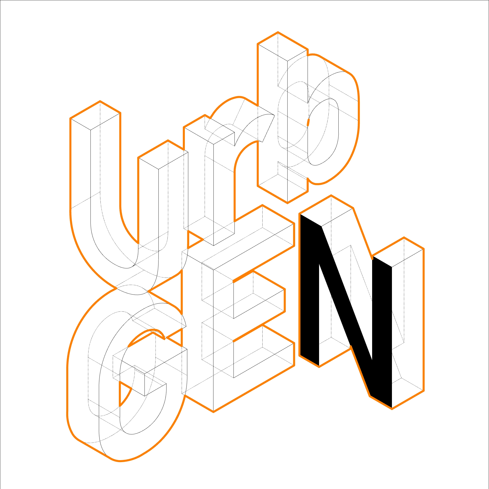
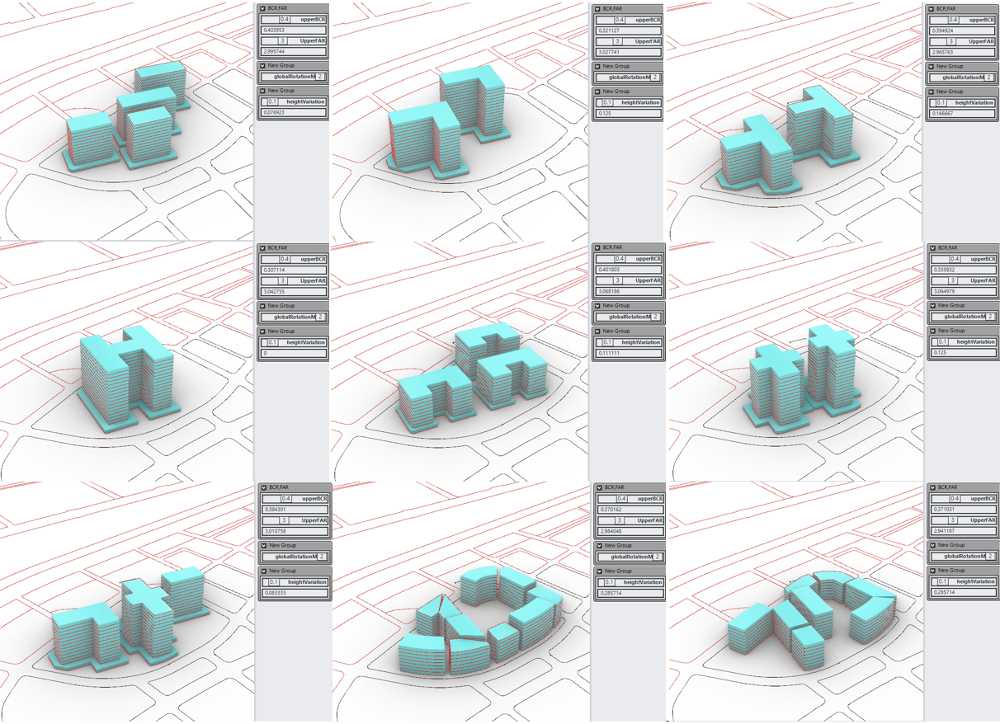
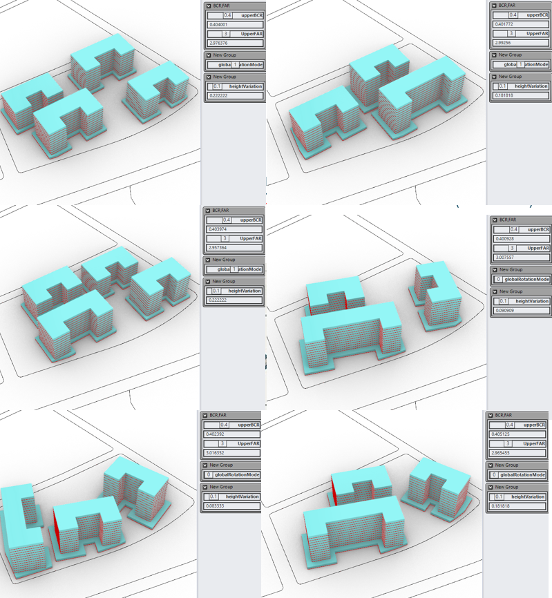
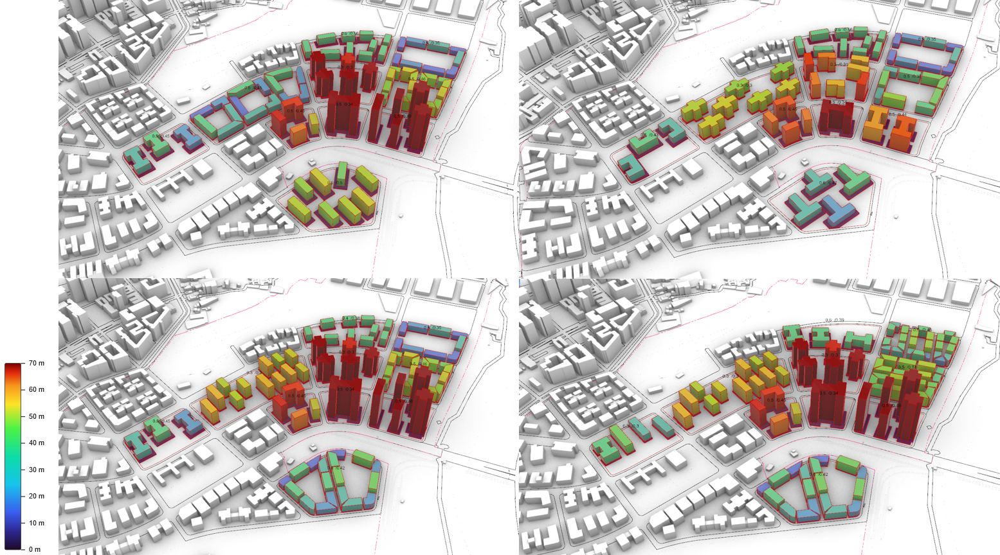
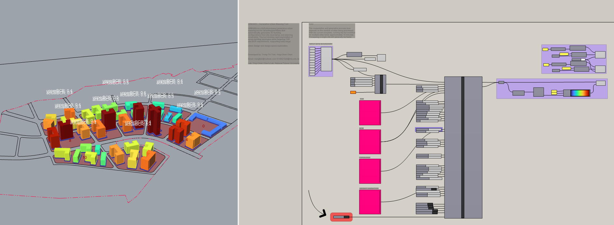
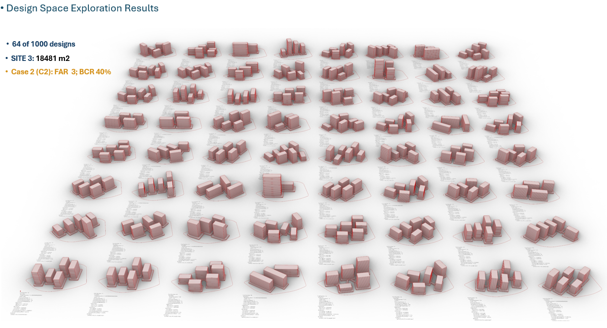
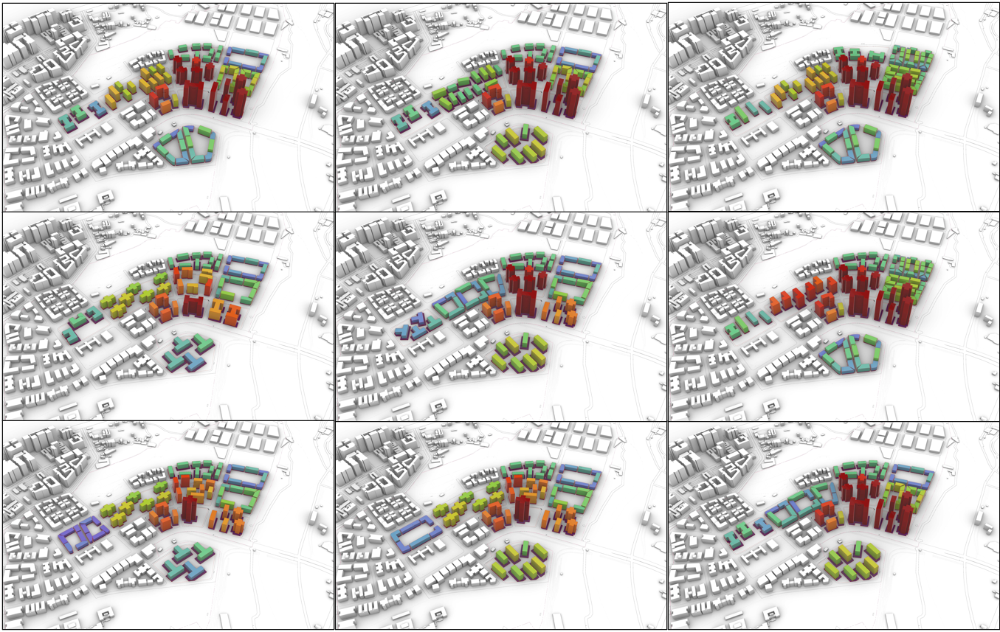
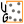

# UrbGEN Documentation

<p align="left">
  
</p>

<p align="left">
  <strong>Generative urban massing under planning constraints</strong><br>
  A GhPython-based tool for Grasshopper / Rhino
</p>

---
UrbGEN — Generative Urban Massing Tool


UrbGEN is a GhPython-based generative urban massing tool for Grasshopper/Rhino that automatically generates 3D building configurations from site boundaries and planning constraints. The tool enables rapid exploration of seven building typologies while targeting Building Coverage Ratio (BCR), Floor Area Ratio (FAR), building height, orientation,... requirements, supporting early-stage urban design and design-space exploration.


Developed by: [Trong-Tin Tran](https://sites.google.com/view/trantrongtin) and [Ying-Chieh Chan](https://yingchiehchan.com/)

Lab: Ying-Chieh Chan's Lab, Department of Civil Engineering, National Taiwan University

Email: trongtintr@outlook.com | D14521024@ntu.edu.tw

# UrbGEN

## What is UrbGEN?

UrbGEN is a GhPython-based generative urban massing tool for Grasshopper / Rhino
that automatically generates 3D building configurations from site boundaries and
planning constraints. It enables rapid exploration of seven building typologies
while targeting FAR and BCR requirements, supporting multi-stage urban design
and design-space exploration.

Instead of modelling massing options by hand, the designer defines the
regulatory envelope — coverage, plot ratio, height limit, setback — and UrbGEN
resolves a family of valid configurations that satisfy it.


*Massing generated across eleven sites, coloured by building height.*

---

## Why BCR and FAR?

Building Coverage Ratio and Floor Area Ratio are how almost every zoning code
regulates urban form. But the pair **underdetermines form**: a parcel at
BCR 0.40 and FAR 3.0 can be slender towers on open ground, a perimeter block
around a courtyard, or a dense low mat. All equally compliant — and very
different for daylight, ventilation, thermal comfort and energy use.

That gap between compliance and performance is the research question. UrbGEN
treats the pair as a **constraint to converge on rather than an outcome to
measure afterwards**, generating hundreds of compliant alternatives at fixed
density — turning the regulatory envelope into a controlled experimental frame.

---

---

## Key Features

<table>
<tr>
<td width="33%" valign="top">

### Constraint-driven

Converges on target **BCR** and **FAR** simultaneously, reporting the achieved
values and the residual error for every site.

</td>
<td width="33%" valign="top">

### Seven typologies

**I, L, T, H, C/U, Plus** and **Courtyard** footprints, selectable per site or
assigned automatically.

</td>
<td width="33%" valign="top">

### Multi-site batch

Processes an entire block or district in one solve, with independent planning
targets per parcel.

</td>
</tr>
<tr>
<td width="33%" valign="top">

### Tower + podium

Generates podium masses with configurable offset, floor count and thickness,
plus tower-to-podium ratio metrics.

</td>
<td width="33%" valign="top">

### Height regulation

Enforces maximum and minimum building heights in strict or soft modes, and
reports violations and adjusted counts.

</td>
<td width="33%" valign="top">

### Design-space ready

A seed input makes every run reproducible, so the component plugs directly into
Wallacei, Colibri or Sobol sampling.

</td>
</tr>
</table>

---

## How it works

The component takes a site curve and a set of planning targets, grows building
footprints iteratively until the coverage and plot-ratio targets are met, then
extrudes, places and aligns the masses within the setback envelope.

[](images/urbgen-workflow.png)

*Click to view the full definition.*

**Pipeline**

1. **Input** — site boundary curve(s), setback distance, target BCR and FAR
2. **Populate** — candidate centroids distributed within the buildable area
3. **Typology** — footprint generated for each centroid from the selected grammar
4. **Grow** — footprints scaled iteratively toward the BCR target
5. **Extrude** — floor counts derived from the FAR target and floor height
6. **Position** — snap to setback, align to edges, move tower to podium edge
7. **Report** — actual BCR / FAR / GFA / heights returned as outputs

---

## Building Typologies

Seven footprint grammars (I,L,T,H,C/U,plus,courtyard,mixed), each parametrised by arm length ratio, width and
length-to-width limits.




*Nine configurations at BCR 0.40 / FAR 3.0 — the constraint is held constant
while the typology and rotation mode vary.*



*C/U typology under the same planning envelope, with and without global rotation.*

---

## Planning Parameters

| Parameter | Input | Description |
|---|---|---|
| **FAR** | `upperFAR` | Target floor area ratio; drives floor count and total GFA |
| **BCR** | `upperBCR` | Target building coverage ratio; drives footprint growth |
| **Height** | `maxBuildingHeight`, `minBuildingHeight`, `heightVariation` | Regulated envelope with strict or soft enforcement |
| **Setback** | `setback` | Offset from the site boundary defining the buildable area |
| **Orientation** | `globalRotationMode`, `uniformRotationDeg`, `alignTowersToEdge` | Uniform, per-building or edge-aligned rotation |

Additional groups cover **sizing and density** (footprint bounds, minimum tower
distance, growth step and iterations), **podium** (floors, offset range, floor
height), **courtyard** (count, break width, split angle, layout mode) and
**positioning** (snap to boundary, snap to setback, edge alignment).

See [Components](components.md) for the full input and output reference.



*Four generated alternatives on the same site, coloured 0–70 m.*

---

## Example

A typical definition: site curves on the left, planning targets grouped by
category in the middle, the UrbGEN component and its outputs on the right.



*Each site is labelled with its target BCR and the value actually achieved.*

Because the solver is seeded, the same definition can be swept across a
parameter space to produce large sets of valid alternatives:



*64 of 1000 designs — Site 3, 18,481 m², at FAR 3.0 and BCR 40%.*



Sample files are provided in the `UrbGEN_example` folder of the repository.

---

## Documentation

<table>
<tr>
<td width="33%" valign="top">

### [Installation](installation.md)

Install through the Rhino Package Manager, the Yak CLI, or by dropping the
`.gha` file into the Grasshopper components folder.

</td>
<td width="33%" valign="top">

### [Components](components.md)

Reference for every input and output of the two UrbGEN components.

</td>
<td width="33%" valign="top">

### [Examples](examples.md)

Grasshopper definitions covering single-site, multi-site and design-space
workflows.

</td>
</tr>
</table>

### Quick install

Open Rhino, run the `PackageManager` command, search for **urbgen** and install.
Restart Rhino — the components appear under the **UrbGEN** tab in Grasshopper.

Alternatively, install the `.yak` package from the command line:

```
"C:\Program Files\Rhino 8\System\Yak.exe" install urbgen
```

### Components

| | Component | Purpose |
|---|---|---|
|  | **UrbGEN Generator** | Generates masses from a site curve under BCR / FAR / height constraints |
|  | **UrbGEN Populate Region** | Distributes candidate building centroids inside a bounded region |

---

## Research

### Methodology

UrbGEN was developed as part of ongoing research on generative urban morphology
and environmental performance. The tool couples a rule-based footprint grammar
with an iterative growth solver.

Generated datasets feed downstream analysis in Ladybug/Honeybee, ENVI-met and
multi-objective optimisation workflows, supporting studies of daylight, view
access, energy use intensity and outdoor thermal comfort across morphological
alternatives.


---

## About

**[Trong-Tin Tran](https://sites.google.com/view/trantrongtin)** and **[Ying-Chieh Chan](https://yingchiehchan.com/)**

Ying-Chieh Chan's Lab, Department of Civil Engineering, 
National Taiwan University

Contact: [trongtintr@outlook.com](mailto:trongtintr@outlook.com) | [D14521024@ntu.edu.tw](mailto:d14521024@ntu.edu.tw)

Released under the MIT License.


## Components by Subcategory
### UrbGEN
| Name | Description |
|---|---|
|  [UrbGEN generator](components/UrbGENgenerator.md) | UrbGEN generator component |
|  [UrbGEN_PopulateRegion](components/UrbGENPopulateRegion.md) | UrbGEN_PopulateRegion component |

